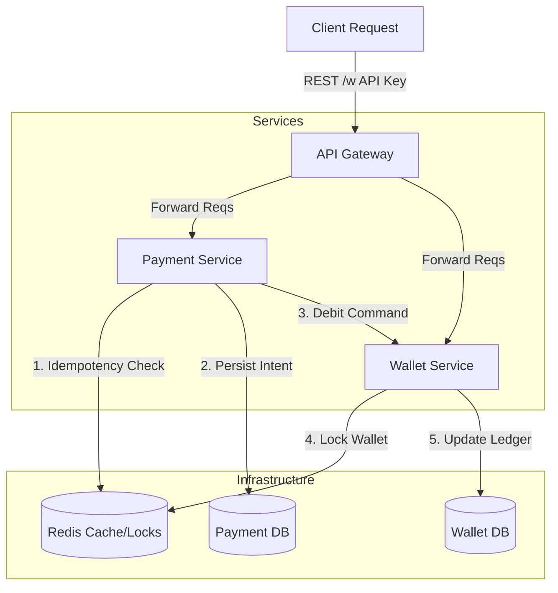

# Distributed Payment Processing System

A production-grade, distributed payment processing system designed for **high availability**, **reliability**, and **financial correctness**. It handles payments, wallet debits/credits, and ledger management with exactly-once processing guarantees.

## 🚀 Key Features

*   **Microservices Architecture**: Decoupled services for API Gateway, Payments, and Wallets.
*   **Idempotency Everywhere**: End-to-end idempotency using Redis and Postgres constraints to prevent double-spending and duplicate processing.
*   **Distributed Locking**: Redis-based locking prevents race conditions on wallet balances.
*   **Event-Driven & Ledger**: Immutable ledger for auditability and event sourcing concepts for state changes.
*   **Resiliency**: Exponential backoff retries, graceful degradation, and failure handling for network partitions.
*   **Rate Limiting**: Sliding window rate limiting at the Gateway level.

## 🏗 Architecture



### Components

1.  **API Gateway (Node.js/Express)**: Entry point. Handles Authentication (API Keys), Rate Limiting (Redis), and Request Forwarding.
2.  **Payment Service (Node.js/Express)**: Orchestrates payment flow. manages payment state (`PENDING` -> `PROCESSING` -> `COMPLETED/FAILED`), ensures idempotency.
3.  **Wallet Service (Node.js/Express)**: Manages user balances. Maintains an append-only ledger. Enforces strict consistency on funds.
4.  **Infrastructure**:
    *   **PostgreSQL**: Primary data store. Separate databases for Payment and Wallet services to ensure decoupling.
    *   **Redis**: Used for caching (idempotency keys), distributed locks, and rate limiting counters.

## 🛠️ Getting Started

### Prerequisites

*   Node.js >= 18
*   Docker & Docker Compose
*   Make (optional, but recommended)

### Running Locally

1.  **Clone & Install**:
    ```bash
    git clone <repo-url>
    cd distributed-payment-system
    npm install
    ```

2.  **Start Infrastructure & Services**:
    We use Docker Compose to spin up Postgres, Redis, and all microservices.
    ```bash
    docker-compose up --build
    ```
    *   *Alternatively, run `make dev` if `make` is available.*

3.  **Initialize Databases**:
    The system will automatically run migrations on startup (in production scenarios), or you can use the provided script:
    ```bash
    ./infrastructure/init-databases.sh
    ```

4.  **Verify Status**:
    Check if services are healthy:
    ```bash
    curl http://localhost:3000/health
    ```

## 📖 API Examples

### 1. Create a Wallet
Initialize a new wallet for a user.
```bash
curl -X POST http://localhost:3000/api/wallets/create \
  -H "X-API-Key: test_key_merchant_001" \
  -H "Content-Type: application/json" \
  -d '{
    "userId": "user_123",
    "currency": "USD",
    "initialBalance": 10000
  }'
# Response: { "wallet": { "id": "wallet_abc...", "balance": 10000 } }
```

### 2. Make a Payment
Process a payment idempotently. Requires `Idempotency-Key` header.
```bash
curl -X POST http://localhost:3000/api/payments \
  -H "X-API-Key: test_key_merchant_001" \
  -H "Idempotency-Key: unique_req_id_001" \
  -H "Content-Type: application/json" \
  -d '{
    "userId": "user_123",
    "amount": 500,
    "currency": "USD",
    "merchantId": "merchant_xyz"
  }'
```

### 3. Process the Payment (Debit)
Trigger the processing logic (separating intent from execution allows better control).
```bash
curl -X POST http://localhost:3000/api/payments/{payment_id}/process \
  -H "X-API-Key: test_key_merchant_001" \
  -d '{ "walletId": "wallet_abc..." }'
```

## 🛡️ Guarantees

*   **Exactly-Once Processing**: Utilizing `Idempotency-Key` headers stored in Redis (fast path) and Postgres (truth path). Even if the client retries a request, the system will execute the financial transaction exactly once.
*   **Balance Integrity**: The Wallet Service uses row-level locking (`FOR UPDATE`) or optimistic concurrency control alongside an append-only ledger to ensure balances never go negative (unless allowed) and race conditions don't corrupt funds.
*   **Fault Tolerance**: If the `Wallet Service` is temporarily down, the `Payment Service` retries with exponential backoff. If it fails permanently, the payment status is recorded as `FAILED`, preserving system consistency.

## 📂 Project Structure

```
distributed-payment-system/
├── services/
│   ├── api-gateway/       # Routing, Auth, Rate Limiting
│   ├── payment-service/   # Payment Lifecycle, Idempotency
│   └── wallet-service/    # Ledger, Balance Management
├── shared/                # Shared Types, Events, and constants
├── infrastructure/        # SQL Schemas, Docker configs
├── docker-compose.yml     # Orchestration
└── package.json           # Monorepo root
```

## 🧪 Testing

Run integration tests to verify the flow:
```bash
npm run test:integration
```
This spawns test instances and hits the API endpoints to verify duplicate handling and concurrent debiting scenarios.
